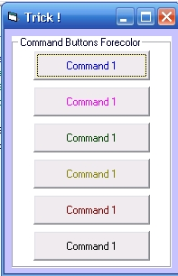



## Command Buttons Trick \!

### Description

This trick changes a Command Buttons Forecolor. I've seen lots submission here changing Command buttons forecolor using API's. This trick achieves the same effect but just a 3 lines of code. NO API's required !. Have nice day ! No need for votes ! just comments will do !
 
### More Info
 

             |
---                |---
**Submitted On**   |2005-12-03 23:40:06
**By**             |[Mark Anthony Dinglasa](https://github.com/Planet-Source-Code/PSCIndex/blob/master/ByAuthor/mark-anthony-dinglasa.md)
**Level**          |Beginner
**User Rating**    |3.8 (15 globes from 4 users)
**Compatibility**  |VB 5\.0, VB 6\.0
**Category**       |[Custom Controls/ Forms/  Menus](https://github.com/Planet-Source-Code/PSCIndex/blob/master/ByCategory/custom-controls-forms-menus__1-4.md)
**World**          |[Visual Basic](https://github.com/Planet-Source-Code/PSCIndex/blob/master/ByWorld/visual-basic.md)
**Archive File**   |[Command\_Bu1953491232005\.zip](https://github.com/Planet-Source-Code/mark-anthony-dinglasa-command-buttons-trick__1-63479/archive/master.zip)

